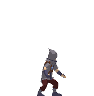
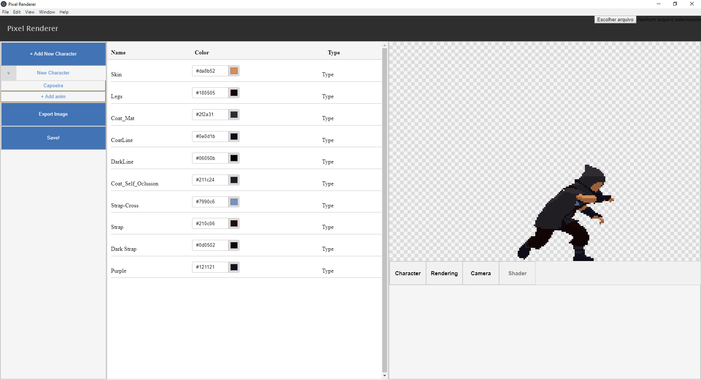

# Pixel-Renderer

## Npm installation command(Requires Electron):
- npm install --save-dev electron

## Project has been Deprecated. Three.js had some problems making saved animations load properly

## Results:

## Layout:

## TODO: Overall
- ~~Set character default view settings(still have individual anim settings)~~
- ~~Fix not being able to change material color after loading another object~~
- ~~And add the material loader to object changing~~
- ~~Fix changing object not correctly updating render percent~~
- Add Saving stuff
- Add remove animation and charater option
- Add default character import options (camera, rendering, character AND materials)
- Create a custom HTML Input text and use it for animation and character name
- Add scene navigation with mouse
- Pixelated font 
- Fix bug that makes the image exporter get the frame before reinitializing everything
- Check how to make a decent import
- Create .pr file for object and animtion using the toJSON from the object and clip. Doing it another way(how i'm currently doing it) may cause problems

